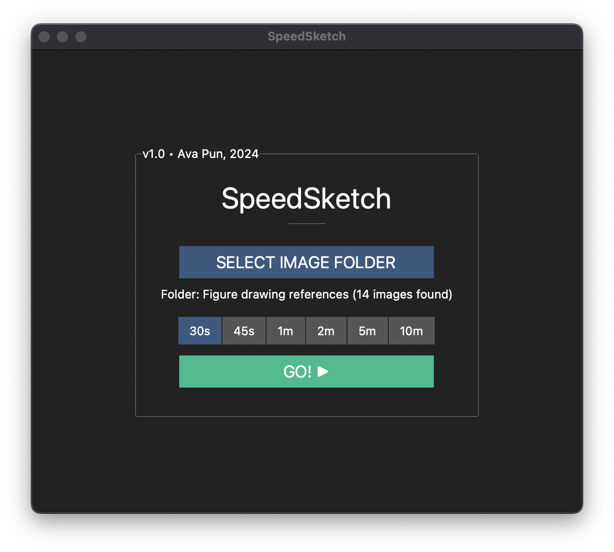

# SpeedSketch: Timed Drawing App

**[Download (Mac)](https://github.com/AvaLovelace1/speed-sketch/releases/latest)**

**SpeedSketch** is a free app that allows you to create timed drawing sessions using photo references on your own
computer—perfect for gesture studies, figure drawing practice, and the like.
It was inspired by [GestureDrawing!](https://cubebrush.co/advanches/products/d9q6yq/gesturedrawing?q=gesturedrawing)
and [Quickposes](https://quickposes.com/en/desktop-app).

Given an input folder, SpeedSketch scans the folder for images. It then displays them one by one in a
random order, each for a specified amount of time.


 

## Installation

### Pre-built binaries (Mac)

You can find pre-built Mac applications (Intel and Apple Silicon)
**[here](https://github.com/AvaLovelace1/speed-sketch/releases/latest)**.

### Building from source (Mac + Windows)

#### Prerequisites

To build from source, you must have [Python](https://www.python.org/downloads/) installed.

#### Instructions for Mac (bash/zsh)

First clone this repository:

```bash
git clone https://github.com/AvaLovelace1/speed-sketch.git
cd speed-sketch
```

Then, create the Python virtual environment:

```bash
python3 -m venv .venv  # Initialize python virtualenv
source .venv/bin/activate  # Activate virtualenv
pip install -r requirements.txt  # Install required packages
```

To build the application, we use [py2app](https://py2app.readthedocs.io/en/latest/).
The app will be saved to the folder `dist`.

```bash
pip install py2app
python setup.py py2app
```

> [!NOTE]
> Issues may arise if [PyInstaller](http://www.pyinstaller.org) is installed at the same time as py2app.
> If this is the case, try uninstalling PyInstaller.

#### Instructions for Windows (cmd.exe)

First clone this repository:

```bash
git clone https://github.com/AvaLovelace1/speed-sketch.git
cd speed-sketch
```

Then, create the Python virtual environment:

```bash
python3 -m venv .venv  # Initialize python virtualenv
.venv\Scripts\activate.bat  # Activate virtualenv
pip install -r requirements.txt  # Install required packages
```

To build the application, we use [py2exe](http://www.py2exe.org).
The app will be saved to the folder `dist`.

```bash
pip install py2exe
python setup.py py2exe
```
