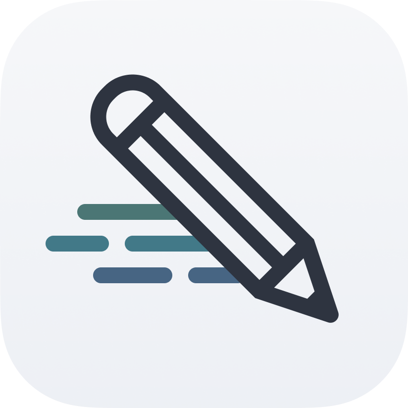

# SpeedSketch: Gesture Drawing App

[![Browser][Browser]][Webapp]
![Windows][Windows]
![macOS][macOS]
![Linux][Linux]

**SpeedSketch** is a free app for creating timed drawing sessions using photo references on your own
computer. It displays all images in a given collection one by one, each for a specified amount of time.
Perfect for gesture studies, figure drawing practice, and the like!

_Available as a [web app][Webapp] and a desktop app for **Windows**, **macOS**, and **Linux**._

## Features

### Choose Your Own Image Collection

- **Custom Image Folder:** Select any folder on your computer to use as an image source.
- **Custom Display Time:** Choose from a list of predefined durations, or set your own duration for each image.
- **Randomize Image Order:** Choose whether to display images alphabetically or in a random order.

### Image Viewing

- **Zoom/Pan:** Scroll to zoom in and out, and click & drag to pan around the image.
- **Flip (Horizontal or Vertical):** Flip the image for more variety.
- **Customizable Image Filters:** Use the **Greyscale**, **Increased Contrast**, and **Blur** filters to focus on shape
  and form.
- **Always on Top Mode (desktop version only):** Keep the app window on top of other windows for easy reference while
  drawing.

### Additional Features

- **Light & Dark Themes:** Switch up the colours for comfortable viewing.
- …and more!

## Installation

### Web Version

[Use SpeedSketch directly in your browser with no installation.][Webapp]

### Desktop Version

[Coming soon]

<!-- Download the latest version of SpeedSketch from the
**[releases page](https://github.com/AvaLovelace1/speed-sketch/releases/latest)**.
Available for Windows, macOS (Intel + Apple Silicon), and Linux. -->

### Build from source

SpeedSketch is built using [Tauri](https://tauri.app). Follow these steps to build from source:

1. Clone this repository with `git clone https://github.com/AvaLovelace1/speed-sketch.git && cd speed-sketch`.
2. Install all [Tauri prerequisites](https://tauri.app/start/prerequisites/), including **System Dependencies**,
   **Rust**, and **Node.js**. (There is no need to **Configure for Mobile Targets**.)
3. Install all dependencies (including Tauri) with `npm install`.
4. Build the web app with `npm run build`, or the desktop app with `npm run tauri:build`.

## Acknowledgements

- Thanks to [Tauri](https://tauri.app), [Svelte](https://svelte.dev),
  [Tailwind CSS](https://tailwindcss.com), [DaisyUI](https://daisyui.com), and [Bits UI](https://bits-ui.com) for the
  amazing open-source technologies that made this app possible.
- Thanks to [Lucide](https://lucide.dev) for the icons, [Mixkit](https://mixkit.co) for the sound effects, and
  [Nord](https://www.nordtheme.com) for the colour scheme.
- Thanks to [Andrew Sindt](https://www.pexels.com/@andrew-sindt-2650965/), [Hong Son](https://www.pexels.com/@hson/),
  [Sasha Kim](https://www.pexels.com/@sasha-kim/), and [JookpubStock](https://jookpubstock.com) for the
  reference images used in examples and testing.
- SpeedSketch was inspired by the wonderful
  [GestureDrawing!](https://cubebrush.co/advanches/products/d9q6yq/gesturedrawing?q=gesturedrawing)
  and [Quickposes](https://quickposes.com/en/desktop-app).

<!-- Links -->

[Webapp]: https://avalovelace1.github.io/speed-sketch/

[Browser]: https://img.shields.io/badge/Web%20Browser-4285F4?logo=GoogleChrome&logoColor=white&style=for-the-badge

[Windows]: https://custom-icon-badges.demolab.com/badge/Windows-0078D6?logo=windows11&logoColor=white&style=for-the-badge

[macOS]: https://img.shields.io/badge/mac-000000?logo=apple&logoColor=F0F0F0&style=for-the-badge

[Linux]: https://img.shields.io/badge/Linux-FCC624?logo=linux&logoColor=black&style=for-the-badge
